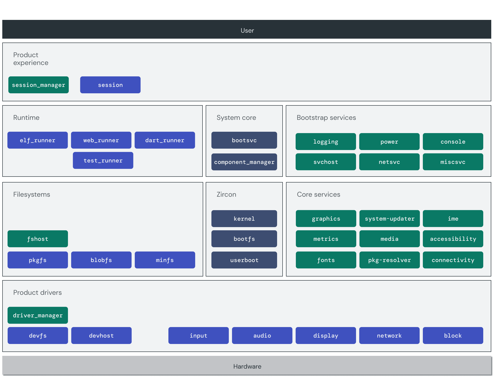
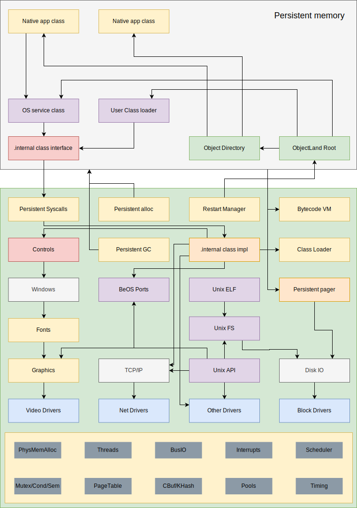

# Architecture patterns

**Khaled Ismaeel, ST-6, k.ismaeel@innopolis.university**

## Task 1

### 1.1

Three definitions of _software architecture_:

- **Philosophical definition**: a structured description of all components of a system and their interactions among each other and with the environment.
- **Bureaucratic definition**: an artifact generated at the design stage of a system that leaves no room for ambiguity during implementation.
- **Programmatic definition**: an artifact that uniquely defines the public interfaces (that is, without defining implementation) of a collection of software components and their dependencies.

### 1.2

For this task we fetched 3 architectures from the industry. The first architecture is a microservice that comes from OpenStack [3].

This architecture depicts a cloud that hosts microservices. Ironically, it is a microservice architecture in itself. There are several services with clearly separate resources and tasks which interact with a well-defined API.

The second example is a layered architecture that comes from the Google Fuchsia project [4].

Here each layer utilizes services of the layer below and provides services to the layer above. This is similar to the TCP/IP stack.

The third and final example is a microkernel architecture that comes from the Phantom OS project [5].

This looks similar to the second example in the sense that there are layers. However, in this architecture there is emphasis on the microkernel architecture. The operating system kernel is relatively small while all drivers are operating as plugins.

### 1.3

Software architecture is concerned with the programmatic side of the system and is often agnostic to the distribution of the program logic onto components. The system architecture is concerned with the components and is often agnostic to the programmatic artifacts under consideration.

### 1.4

**Correctness and robustness**: Software correctness is the software's ability to return the correct results. Software robustness is the software's ability to maintain correctness while operating in a hostile environment.

**Topics and queues**: A message in a topic is delivered to every subscriber to that topic. A message in a queue is only delivered to the entity extracting from the queue.

**Architecture and design**: Architecture is meant to deliver a strategic abstraction of the system, design is meant to deliver an tactical implementation of the system.

**Users, primary stakeholders, and secondary stakeholders**: A user is a client served by the system. A primary stakeholder is an entity with an interest in the system's internal operation (often investors). A secondary stakeholder is an entity with an interest in the systems's external operation (often partners).

**Cohesion and coupling**: Cohesion is the inter dependence of components inside a software module. Coupling is the inter dependence of components between modules.

## Task 2

### 2.1

Object oriented programming concepts are broad and convoluted, here we present a selected few only.

- **Data abstraction**: software entities are only accessible through a high level interface that ensures data is not manipulated in an erroneous manner.
- **Data encapsulation**: only a selected subset of data is accessible, irrelevant internal data structures are hidden from the end user.
- **Inheritance**: a type can be defined to be a special case of another type with additional functionality.
- **Polymorphism**: a variable of certain static type can hold values of other dynamic types as long as they are a special case of the static type.
- **Dynamic dispatch**: a static function call can map to different function definitions depending on the dynamic type.

### 2.2

An architectural view is a specification of software taking into account the view point of a certain type of stakeholders while leaving everything outside this view point undefined. There is a widely accepted view model known as 4 + 1. It distinguishes 5 architectural views: logical, development, process, physical, and general use case scenarios.

I am not really sure what you meant by "Explain characteristics of architecture patterns in pattern based", I assume you meant "Explain characteristics of architecture views in pattern based architectures.", so I will present the 5 views on the microservice architecture.

- Logical: this is the view of system designers with all the components and their inter connections and what not.
- Development: this is the view of software developers with all the technology stack and software packages and etc.
- Process: this is the view of operations teams with the communication channels between the various components and the networking and so forth.
- Physical: this is the view of the system administrators and deployment teams with all the servers and networks etc.
- Scenarios: the various use cases of the system.

### 2.3 and 2.4

Various sources would create different lists. To make life easier for us, we will assume that the UML folks already looked at all different ways to make an architectural description. Below is a quick comparison of a selected subset of UML diagrams!

| Approach | Quick description | Advantage | Disadvantage | Example | 
| -------- | ----------------- | --------- | ------------ | ------- |
| Class | Object oriented description of system architecture | Maps directly to program code | Too detailed |  |
| Component | Description of the program modules and their interconnection | Very intuitive | Can be a bit vague in the implementation process |  | 
| Deployment | Description of the deployment of various artifacts on top of resources | Maps to real life easily | Depicts very specific information with narrow target audience (operations team only) |  |
| Use case | Description of the system operation from the end user point of view | Useful for business needs | Needs a lot of interpretation before it can be mapped into functionality |  |
| Activity | A flowchart essentially | Depicts algorithms quite nicely | Very tedious to incorporate data/state into it |  |
| State machine | Finite state machine! | Mathematically and programmatically easy to deal with | Kind of far from real life situations |  |
| Sequence | A depiction of the communication between different entities along time | Depicts chronological development quite clearly | Doesn't map to states nicely |  |

## References

1. https://resources.sei.cmu.edu/asset_files/factsheet/2010_010_001_513810.pdf
2. https://martinfowler.com/architecture/
3. https://docs.openstack.org/install-guide/get-started-logical-architecture.html
4. https://fuchsia.dev/fuchsia-src/get-started/learn/intro/architecture
5. https://phantomdox.readthedocs.io/en/latest/
6. https://www.lucidchart.com/blog/types-of-UML-diagrams
