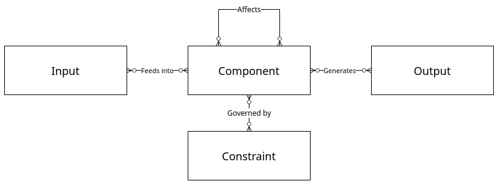

# Identification of a system

**Khaled Ismaeel, ST-6, k.ismaeel@innopolis.university**

## Task 1

A system is a collective of components. These components interact among each other and with outside entities according to a set of rules and, possibly, produce output in the process.

Cars are such a nice example of a system. They have components (the drivetrain, suspension, wheels, etc), they interact (among each other and with the driver), and they produce an output (torque to the wheels).

## Task 2

The components, the input, the output, and the constraints (or rules) which govern their interactions. A very crude approximation of this is presented in the UML diagram below.

The above diagram is inaccurate since constraints govern interactions between components, not only components. Regardless of the many other inaccuracies, let's accept it for now.

## Task 3

Feedback is the state where the output of a system is connected to its input. It helps when a system is meant to be self-governing; it is essential for the system to read its own output in order to autonomously guide itself.

Not all feedback is helpful though, sometimes we have to avoid it as designers or work around it as users. Think of the feedback from the headphone to the microphone.

## Task 4

An information system is a system in the context of Shannon's information theory. Less formally, it's a system where components receive, store, process, and transmit signals (either digital or analogue).

Think of an airplane; the components include sensors, actuators, CPU's, etc. They all speak the language of signals (or information!).
